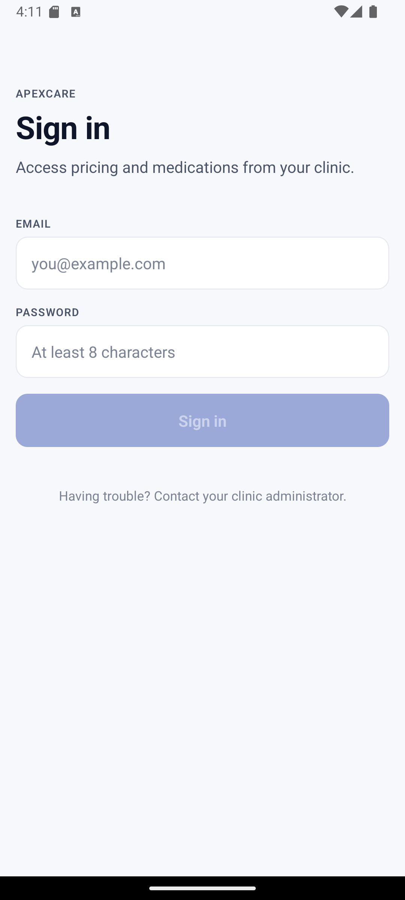
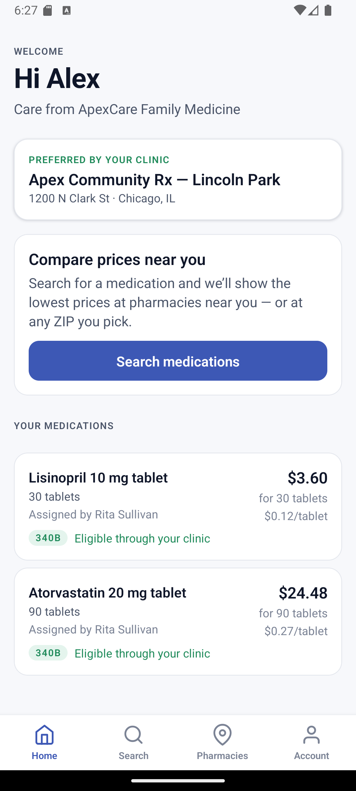
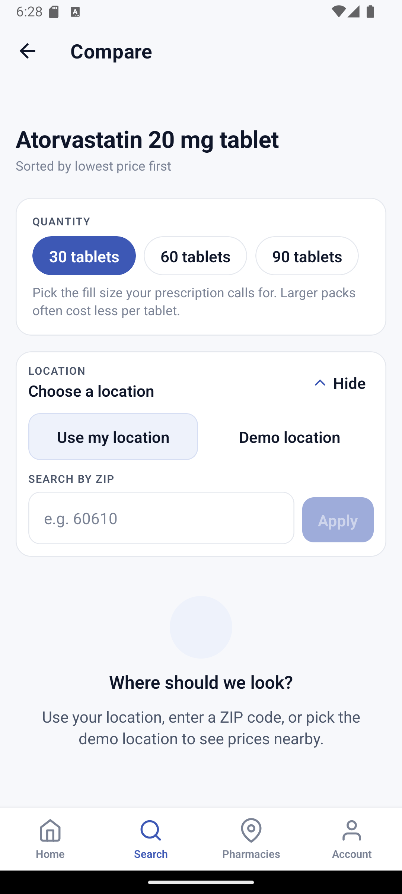
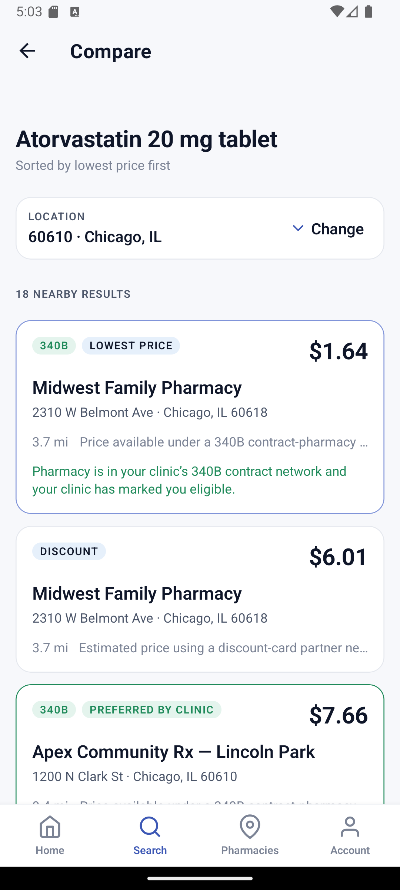

# ApexCare 340B Pricing Platform

> Multi-tenant healthcare app that lets clinic patients compare medication prices across nearby pharmacies — sorted cheapest first, with 340B contract pricing surfaced only when the patient is genuinely eligible. Built as a monorepo: Expo mobile client, NestJS API, PostgreSQL + Prisma, behind typed provider adapters so real pricing/pharmacy/drug-catalog vendors can be swapped in later without product-code changes.

<p align="center">
  
  
  
  
</p>

---

## What it does

**For patients**
- Sign in with credentials issued by their clinic
- See their assigned medications on the home screen with the price at their clinic's preferred pharmacy, quantity (e.g. `30 tablets`), and per-unit cost
- Search the drug catalog by name, pick strength and form, then compare prices at pharmacies near their location — or any ZIP they enter
- Results are sorted cheapest first, with each row labeled by price type (retail cash / discount card / 340B) and distance

**For clinic admins (doctor offices)**
- Manage a patient roster scoped to their clinic
- Create patient accounts, assert 340B eligibility, assign medications at specific fill quantities (30 / 60 / 90 tablets, 120 / 240 mL, etc.)
- View an append-only audit log of everything that happens inside their tenancy (logins, pricing lookups, medication assignments, eligibility changes)

**For the platform**
- Parent organizations can oversee multiple clinics; a super admin role oversees the whole platform
- Strict tenant isolation enforced at three layers (route guard → service-layer `where` builders → Prisma client extension) so cross-tenant reads can't happen even if a query is written wrong
- Audit log is Postgres-trigger-enforced append-only — even a bad app deploy can't rewrite history

---

## The 340B guardrail

The piece that makes this more than a generic price-comparison app. A `CONTRACT_340B` price is only shown to a patient when **all three** of the following are true:

1. The patient's clinic is a HRSA-designated covered entity (`Organization.isCoveredEntity340B`)
2. The pharmacy has an active `PharmacyNetworkEligibility` row for that clinic at `priceType = CONTRACT_340B` (i.e. a real contract-pharmacy arrangement)
3. The clinic has explicitly asserted the patient's eligibility (`PatientProfile.eligibility340BAsserted`)

Otherwise, the 340B quote is **suppressed entirely** — the app never falls back to a retail label on a 340B price or implies eligibility the patient doesn't actually have. The logic lives in `PricingService.compare`, with a focused unit test suite locking it in ([pricing.guardrail.spec.ts](apps/api/src/modules/pricing/pricing.guardrail.spec.ts)).

---

## Stack

| Layer | Tech |
|---|---|
| Mobile | Expo SDK 51 + expo-router, React Native 0.74, TanStack Query, Zustand |
| API | NestJS 10, REST (URI versioning `/v1`), class-validator + Zod at the edges |
| Database | PostgreSQL 16 + Prisma 5 |
| Auth | JWT (HS256) access tokens + opaque rotating refresh tokens, argon2id passwords |
| Monorepo | pnpm workspaces + Turborepo |
| Mobile distribution | EAS Build → TestFlight / Play Internal (development / staging / production channels) |
| API deployment | Multi-stage Docker image → AWS ECS Fargate behind an ALB, GitHub Actions → ECR |

All provider integrations go through typed interfaces in `packages/providers-contracts/`:

- `DrugCatalogProvider` — drug identity (name / strength / form / RxNorm). Mocked with a seeded RxNorm subset; RxNav is the planned live backing.
- `PharmacyDirectoryProvider` — nearby pharmacies for a given lat/lng. Mocked with 18 pharmacies across Chicago / Austin / New York; NCPDP or a vendor feed later.
- `PricingProvider` — per-pharmacy price quotes for a (drug, quantity) pair. Mocked with deterministic per-unit pricing and a realistic bulk-fill discount curve.
- `EligibilityProvider` — whether a patient qualifies for a given pricing program at a given pharmacy. Backed by clinic assertions in v1; TPA-backed later.
- `LocationResolverProvider` — resolves a US ZIP code to a centroid. Seeded with 21 ZIPs covering the pharmacy cities; real geocoder (Smarty / Google Maps) plugs in behind the same interface.

This is important: **no real vendor integrations are included**. The honest answer is that 340B and cash-discount pricing networks don't expose a free, public, plug-and-play API — the app is architected so a vendor feed drops in without touching product code, and ships today with realistic mocks.

---

## Screenshots

| Patient sign-in | Home with prices |
|---|---|
|  |  |

| Pick quantity + location | Compare results |
|---|---|
|  |  |

---

## Run it locally

### Prerequisites

- Node 20.11+ (`.nvmrc` committed)
- pnpm 9.12+ (`corepack enable && corepack prepare pnpm@9.12.0 --activate`)
- Docker Desktop (for Postgres)
- For mobile: Expo Go on a physical device, or an iOS Simulator / Android emulator

### First-time setup

```bash
pnpm install

# Start Postgres in Docker
cp .env.example .env
pnpm db:up

# Configure + initialize the API
cp apps/api/.env.example apps/api/.env
pnpm --filter @apexcare/api exec prisma generate
pnpm --filter @apexcare/api exec prisma migrate deploy
pnpm db:seed

# Run the API (terminal 1)
pnpm api:dev
# → http://localhost:4000/v1/health

# Run the mobile app (terminal 2)
cp apps/mobile/.env.example apps/mobile/.env
pnpm mobile:dev
# Press `i` for iOS, `a` for Android, or scan the QR with Expo Go
```

### Seeded credentials

The seed creates **ApexCare Health Network** — a parent organization with three clinics, two patients each, an org admin, and pre-assigned medications with realistic fill quantities. The Family Medicine clinic is the covered entity for 340B.

```
# 340B-eligible patient (full demo flow — see 340B badges on results)
alex.martinez.apexcare-family-medicine@apexcare.test / Patient!Seed

# Org admin (manage patients, assign medications, view audit)
admin.apexcare-family-medicine@apexcare.test / OrgAdmin!Seed

# Parent admin (sees all three clinics)
parent@apexcare.test / ParentAdmin!Seed

# Super admin (platform-wide)
super@apexcare.test / Sup3rAdmin!Seed
```

The seed log prints credentials for every seeded account at the end.

### End-to-end demo script

1. Sign in as the Family Medicine patient — the home screen shows `Lisinopril 10 mg tablet · 30 tablets` and `Atorvastatin 20 mg tablet · 90 tablets` with their 340B prices already resolved at the preferred pharmacy.
2. Go to Search → type `atorvastatin` → tap the 20 mg result.
3. Pick a quantity chip (30 / 60 / 90 tablets). Larger packs earn a bulk discount.
4. Enter ZIP `60610` → Apply. Results list sorts ascending by total price, with unit price (`$0.12/tablet`) shown next to each card and `340B` badges only on the three Chicago pharmacies in the clinic's contract network.
5. Sign out, sign in as the org admin — create a patient, assign a medication with a custom fill quantity, toggle 340B eligibility, then check the Audit tab.

---

## Common scripts

```bash
pnpm dev               # API + mobile in parallel
pnpm api:dev           # NestJS with --watch
pnpm mobile:dev        # Expo dev server

pnpm lint              # ESLint across all packages
pnpm typecheck         # tsc --noEmit (turbo-cached)
pnpm test              # unit tests

pnpm db:up             # docker compose up postgres
pnpm db:down           # docker compose down
pnpm db:migrate        # prisma migrate dev
pnpm db:seed           # run apps/api/prisma/seed.ts
pnpm db:reset          # DESTRUCTIVE: drop + re-migrate + re-seed
```

---

## Repository layout

```
apps/
  api/                  NestJS service, Prisma schema, migrations, seed, Dockerfile
  mobile/               Expo app, design system, auth-gated routes
packages/
  shared-types/         Role/enum/DTO/Zod schemas shared by API and mobile
  providers-contracts/  DrugCatalog / PharmacyDirectory / Pricing / Eligibility / LocationResolver interfaces
  api-client/           Typed fetch client consumed by the mobile app
```

Everything that crosses the wire (DTOs, enums, problem details, API URLs) lives in `packages/shared-types` and re-exports through `packages/api-client`. The mobile app never imports strings for route paths or response shapes — it imports types, so contract drift between tiers is a compile error instead of a runtime bug.

---

## API surface (selected)

All routes are versioned under `/v1` and return RFC 7807 `application/problem+json` on error.

```
# Auth
POST   /v1/auth/login              { email, password }      → tokens + user
POST   /v1/auth/refresh            { refreshToken }
POST   /v1/auth/logout
POST   /v1/auth/password           { currentPassword, newPassword }
GET    /v1/me
GET    /v1/me/patient-profile      (patient self)
GET    /v1/me/medications          (patient self — includes preferred-pharmacy price)

# Catalog + pharmacies + pricing
GET    /v1/medications/search?name=&strength=&form=&limit=
GET    /v1/pharmacies/nearby?lat=&lng=&radiusMiles=&limit=
GET    /v1/locations/resolve-zip?zip=
POST   /v1/pricing/compare         { rxcui, location, patientId?, quantity?, limit? }

# Admin (scoped to tenancy envelope)
GET    /v1/organizations
POST   /v1/parent-organizations/:parentId/organizations
POST   /v1/organizations/:organizationId/admins
GET    /v1/organizations/:organizationId/patients
POST   /v1/organizations/:organizationId/patients
GET    /v1/patients/:id
PATCH  /v1/patients/:id
POST   /v1/patients/:id/medications
GET    /v1/patients/:id/medications
GET    /v1/audit?action=&actorUserId=&from=&to=&cursor=&limit=

GET    /v1/health                  liveness
GET    /v1/health/ready            readiness (pings DB)
```

---

## HIPAA posture

This scaffold implements **HIPAA-aware patterns** — it is not a compliance certification:

- TLS in transit (production), encryption at rest via RDS storage and SecureStore on device
- Append-only audit log with Postgres trigger enforcement
- Per-tenant data isolation validated at route guards, service-layer filters, and a Prisma client extension as a safety net
- Sanitizer strips common PHI/secret keys from audit metadata (`email`, `dateOfBirth`, `password`, `lat`, `lng`, free-text notes) before write
- Tokens stored in platform keystore on device, never AsyncStorage
- No PHI in server logs (pino redact config)

A production launch also needs a signed BAA with the hosting provider and subprocessors, a formal risk assessment, policies, employee training, and breach-notification processes. Those are organizational activities outside this repo.

---

## Status

**What works today** (fully demo-able locally):

- Sign-in and auth with refresh-token rotation + reuse detection
- Patient home screen with per-medication prices at the preferred pharmacy
- Medication search (name → strength → form → quantity)
- Pharmacy comparison sorted cheapest-first, with device location **or** ZIP code
- Quantity chip selector with form-driven presets (30/60/90 tablets, 120/240 mL, 1/5 doses, etc.)
- Per-unit pricing shown alongside total, with bulk-fill discounts at 60+ / 90+
- 340B guardrail fully enforced with unit coverage
- Admin flows: create patient, assign medication, assert eligibility, view audit log

**Not yet implemented** (intentional — see the architecture comments in each area):

- Real pricing vendor integration (adapter interface exists; mock ships today)
- Real RxNav drug catalog (adapter exists)
- Real geocoder (adapter exists; mock has ~20 ZIPs)
- MFA for admin accounts (schema field present, enrollment flow is next)
- SSO / OIDC for enterprise buyers
- Push notifications for price drops

---

## License

Proprietary. All rights reserved.
